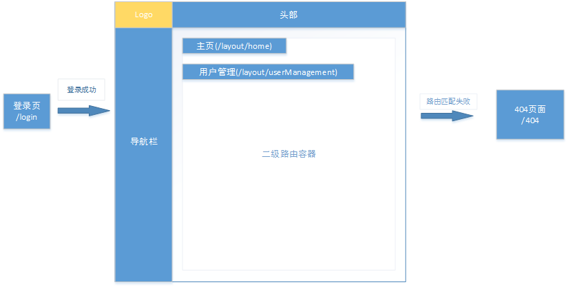

# 搭建react开发环境

本次操作涉及内容：npm 、yarn、creat-react-app、antd、react-router-dom、axios、localrage.js、react-redux、@rematch、inmutalbe.js

[TOC]

### 1、基于create-react-app的改造

creat-react-app 是一款 比较成熟的react开发脚手架，能够快速创建一个react项目开发骨架。但是在实际项目中，考虑到其它框架类库的引入以及前端性能的优化，我们还需要做一些个性化的改造。

#### antd配置

antd官网有用 [react-app-rewired](https://ant.design/docs/react/use-with-create-react-app-cn) 配置改造creat-react-app的教程，但是考虑到其它方面的改动，在此我们将解开creat-react-app:  `yarn run eject`  , 解开后如图：


##### antd组件按需引入

[babel-plugin-import](https://github.com/ant-design/babel-plugin-import) 是一个用于按需加载组件代码和样式的 babel 插件，当然我们要先安装这个插件 `yarn add -D babel-plugin-import ` ， 接着我们在App.js中引入antd的Button组件来展示这个插件的效果

*App.js*

```
import React, { Component } from 'react';
import { Button } from 'antd'
import './App.css';

class App extends Component {
  render() {
    return (
      <div className="App">
        <Button type="primary">antd</Button>
      </div>
    );
  }
}

export default App;
```

然后，在webpack.config.js中进行相关的改造， 在这儿的plugins加上babel-plugin-import的配置，这儿的style暂时用‘css’，后边antd改主题的时候，这里style改为true：(ps: 这儿paths.appSrc在paths.js里面有配置，实际上代表src文件目录)

*webpack.config.js*


效果对比：

改造前


改造后


这按需引入存在一个问题，antd的基本标签样式最好是拷出来用ccs全引入，不然在刷新一些页面的时候，会存在基础标签样式不统一的问题。所以我们将'node_modules/antd/dist/antd.css' 里面的基础样式拷贝到index.css里面，当然涉及到的默认颜色，需要自己去把控了。

```
html,
body {
  width: 100%;
  height: 100%;
}
input::-ms-clear,
input::-ms-reveal {
  display: none;
}
*,
*::before,
*::after {
  -webkit-box-sizing: border-box;
          box-sizing: border-box;
}
html {
  font-family: sans-serif;
  line-height: 1.15;
  -webkit-text-size-adjust: 100%;
  -ms-text-size-adjust: 100%;
  -ms-overflow-style: scrollbar;
  -webkit-tap-highlight-color: rgba(0, 0, 0, 0);
}
@-ms-viewport {
  width: device-width;
}
article,
aside,
dialog,
figcaption,
figure,
footer,
header,
hgroup,
main,
nav,
section {
  display: block;
}
body {
  margin: 0;
  color: rgba(0, 0, 0, 0.65);
  font-size: 14px;
  font-family: -apple-system, BlinkMacSystemFont, 'Segoe UI', 'PingFang SC', 'Hiragino Sans GB', 'Microsoft YaHei', 'Helvetica Neue', Helvetica, Arial, sans-serif, 'Apple Color Emoji', 'Segoe UI Emoji', 'Segoe UI Symbol';
  font-variant: tabular-nums;
  line-height: 1.5;
  background-color: #fff;
  -webkit-font-feature-settings: 'tnum';
          font-feature-settings: 'tnum';
}
[tabindex='-1']:focus {
  outline: none !important;
}
hr {
  -webkit-box-sizing: content-box;
          box-sizing: content-box;
  height: 0;
  overflow: visible;
}
h1,
h2,
h3,
h4,
h5,
h6 {
  margin-top: 0;
  margin-bottom: 0.5em;
  color: rgba(0, 0, 0, 0.85);
  font-weight: 500;
}
p {
  margin-top: 0;
  margin-bottom: 1em;
}
abbr[title],
abbr[data-original-title] {
  text-decoration: underline;
  -webkit-text-decoration: underline dotted;
          text-decoration: underline dotted;
  border-bottom: 0;
  cursor: help;
}
address {
  margin-bottom: 1em;
  font-style: normal;
  line-height: inherit;
}
input[type='text'],
input[type='password'],
input[type='number'],
textarea {
  -webkit-appearance: none;
}
ol,
ul,
dl {
  margin-top: 0;
  margin-bottom: 1em;
}
ol ol,
ul ul,
ol ul,
ul ol {
  margin-bottom: 0;
}
dt {
  font-weight: 500;
}
dd {
  margin-bottom: 0.5em;
  margin-left: 0;
}
blockquote {
  margin: 0 0 1em;
}
dfn {
  font-style: italic;
}
b,
strong {
  font-weight: bolder;
}
small {
  font-size: 80%;
}
sub,
sup {
  position: relative;
  font-size: 75%;
  line-height: 0;
  vertical-align: baseline;
}
sub {
  bottom: -0.25em;
}
sup {
  top: -0.5em;
}
a {
  text-decoration: none;
  background-color: transparent;
  outline: none;
  cursor: pointer;
  -webkit-text-decoration-skip: objects;
}
a:focus {
  text-decoration: underline;
  -webkit-text-decoration-skip: ink;
          text-decoration-skip-ink: auto;
}
a:active,
a:hover {
  text-decoration: none;
  outline: 0;
}
a[disabled] {
  color: rgba(0, 0, 0, 0.25);
  cursor: not-allowed;
  pointer-events: none;
}
pre,
code,
kbd,
samp {
  font-size: 1em;
  font-family: 'SFMono-Regular', Consolas, 'Liberation Mono', Menlo, Courier, monospace;
}
pre {
  margin-top: 0;
  margin-bottom: 1em;
  overflow: auto;
}
figure {
  margin: 0 0 1em;
}
img {
  vertical-align: middle;
  border-style: none;
}
svg:not(:root) {
  overflow: hidden;
}
a,
area,
button,
[role='button'],
input:not([type='range']),
label,
select,
summary,
textarea {
  -ms-touch-action: manipulation;
      touch-action: manipulation;
}
table {
  border-collapse: collapse;
}
caption {
  padding-top: 0.75em;
  padding-bottom: 0.3em;
  color: rgba(0, 0, 0, 0.45);
  text-align: left;
  caption-side: bottom;
}
th {
  text-align: inherit;
}
input,
button,
select,
optgroup,
textarea {
  margin: 0;
  color: inherit;
  font-size: inherit;
  font-family: inherit;
  line-height: inherit;
}
button,
input {
  overflow: visible;
}
button,
select {
  text-transform: none;
}
button,
html [type="button"],
[type="reset"],
[type="submit"] {
  -webkit-appearance: button;
}
button::-moz-focus-inner,
[type='button']::-moz-focus-inner,
[type='reset']::-moz-focus-inner,
[type='submit']::-moz-focus-inner {
  padding: 0;
  border-style: none;
}
input[type='radio'],
input[type='checkbox'] {
  -webkit-box-sizing: border-box;
          box-sizing: border-box;
  padding: 0;
}
input[type='date'],
input[type='time'],
input[type='datetime-local'],
input[type='month'] {
  -webkit-appearance: listbox;
}
textarea {
  overflow: auto;
  resize: vertical;
}
fieldset {
  min-width: 0;
  margin: 0;
  padding: 0;
  border: 0;
}
legend {
  display: block;
  width: 100%;
  max-width: 100%;
  margin-bottom: 0.5em;
  padding: 0;
  color: inherit;
  font-size: 1.5em;
  line-height: inherit;
  white-space: normal;
}
progress {
  vertical-align: baseline;
}
[type='number']::-webkit-inner-spin-button,
[type='number']::-webkit-outer-spin-button {
  height: auto;
}
[type='search'] {
  outline-offset: -2px;
  -webkit-appearance: none;
}
[type='search']::-webkit-search-cancel-button,
[type='search']::-webkit-search-decoration {
  -webkit-appearance: none;
}
::-webkit-file-upload-button {
  font: inherit;
  -webkit-appearance: button;
}
output {
  display: inline-block;
}
summary {
  display: list-item;
}
template {
  display: none;
}
[hidden] {
  display: none !important;
}
```


##### antd主题自定义

antd自定义主题需要用到less `yarn add less less-loader`。为了让每个组件内部的样式拥有自己的作用域而又不影响antd组件的样式，添加的less-loader的配置分两块，第一块配置：

`yarn add -D less-vars-to-js`

webpack.config.js中添加：

*webpack.config.js*

```
const lessToJs = require('less-vars-to-js');

// 引入antd自定义样式配置
const themer = lessToJs(fs.readFileSync(path.join(__dirname, '../src/static/antd/theme.less'), 'utf8'));
```

在src文件目录下我们来整一个专门自定义antd主题的less：


them.less里面添加`@primary-color: #1DA57A;`来作为测试。然后在loader里面添加less-loader的配置：

*webpack.config.js*

```
            {
              test: /\.less$/,
              include: /node_modules/,
              use: [
                require.resolve('style-loader'),
                require.resolve('css-loader'),
                {
                  loader: require.resolve('less-loader'),
                  options: {
                    javascriptEnabled: true,
                    sourceMap: true,
                    modifyVars: Object.assign(themer)
                  }
                }
              ]
            }
```

将之前提到的 `style: 'css'`  改为 `style: true`

*webpack.config.js*

```
                  [
                    "import", 
                    {
                      libraryName: 'antd',
                      libraryDirectory: 'es',
                      style: true,
                    }
                  ],
```

重启 项目`yarn start`：


##### antd中文化

 antd 目前的默认文案是英文，进行开发的时候需要在全局配置为中文。我们在App.js中加一个Datapicker组件来展示效果

*App.js*

```
import React, { Component } from 'react';
import { Button } from 'antd'
import './App.css';
import styles from './app.less';
import { DatePicker } from 'antd';

class App extends Component {
  render() {
    return (
      <div className="App">
        <div className={`${styles.app} big`}>ceshi</div>
        <Button type="primary">antd</Button>
        <DatePicker />
      </div>
    );
  }
}

export default App;

```


接着在项目根目录index.js文件中搞事情：

*index.js*

```
import { LocaleProvider } from 'antd';
import zhCN from 'antd/lib/locale-provider/zh_CN';

ReactDOM.render(
    <LocaleProvider locale={zhCN}>
      <App />
    </LocaleProvider>, 
    document.getElementById('root')
);
```


这里有些文案已经变成中文，但是日期里面还是英文。别慌，我们引入moment中文样式

*index.js*

```
import zhCN from 'antd/lib/locale-provider/zh_CN';
import 'moment/locale/zh-cn';

ReactDOM.render(
    <LocaleProvider locale={zhCN}>
      <App />
    </LocaleProvider>, 
    document.getElementById('root')
);
```


#### 组件less样式作用域限制

这里是第二块less-loader配置。webpack.config.js中,在loader中添加：

*webpack.config.js*

```
            {
              test: /\.less$/,
              include: paths.appSrc,
              use: getStyleLoaders(
                {
                  importLoaders: 2,
                  modules: true,
                  localIdentName: '[path]-[local]-[hash:base64:5]'
                },
                'less-loader'
              )
            },
```

新建一个app.less文件，  添加（测试）

*app.less*

```
.app {
    color: red;
}

.big {
    font-size: 60px;
}
```

在App.js中添加测试代码：

*App.js*

```
import React, { Component } from 'react';
import { Button } from 'antd'
import './App.css';
import styles from './app.less';

class App extends Component {
  render() {
    return (
      <div className="App">
        <div className={`${styles.app}` big}>ceshi</div>
        <Button type="primary">antd</Button>
      </div>
    );
  }
}

export default App;
```


#### babel插件

[ @babel/plugin-proposal-export-namespace-from](https://babeljs.io/docs/en/babel-plugin-proposal-export-namespace-from) 引入这个插件是为了支持 `export * as ns from 'mod';`这种方式的导出。

[@babel/plugin-proposal-export-default-from](https://babeljs.io/docs/en/babel-plugin-proposal-export-default-from)是为了支持 `export v from 'mod';`这种方式的导出。

[@babel/plugin-proposal-decorators](https://babeljs.io/docs/en/babel-plugin-proposal-decorators)是为了支持装饰器。

加上这三个babel插件，主要是为了组件统一出口以及组件状态管理connect的简化。

`yarn add -D @babel/plugin-proposal-export-namespace-from `

`yarn add -D @babel/plugin-proposal-export-default-from`

@babel/plugin-proposal-decorators 直接配置就可以了。

在webpack.config.js里面配置：

*webpack.config.js*


#### 文件目录结构

好的文件目录结构能够让整个项目有条有理，便于多人团队协作、后期维护等，好处多的不要的不要的。来，我们把项目文件分成几大块存放：公用组件(components)、容器组件(containers)、公用函数(helpers)、高阶组件(hocs)、公共配置(configs)、静态文件(static)、状态管理(rematch)


在每个相关的目录下创建一个index.js文件，用来统一抛出内部的函数、组件等。containers里面的每一个组件都用一个文件夹表示，文件夹名为组件名，然后在contaniners/index.js里面抛出组件(components里面也是这种操作)


#### 配置引用路径

有时候在引用一个组件或资源的时候，需要一写大串相对路径，这个在后期维护以及组件位置变动的时候，搞不好就会让人抓狂。


### 2、路由配置react-router-dom

在这种组件化开发环境中，react单页面(只有一个index.html)app中每个页面(功能、业务页面)都是一个大的组件，实际业务中根据用户的操作和要求，我们需要一套方案来控制这些业务页面的切换。这个时候react-router-dom就来了。当然，如果时间充裕又有精力的话，不妨自己来实现一个。

`yarn add react-router-dom`

我们设计几个页面来展示路由功能



*containers/Home/index.js*

```
import React, { Component } from 'react';
import styles from './index.less';

class Home extends Component {
  render() {
    return (
      <div className={styles.home}>
      主页
      </div>
    );
  }
}

export default Home
```

*containers/UserManagement/index.js*

```
import React, { Component } from 'react';
import styles from './index.less';

class UserManagement extends Component {
  render() {
    return (
      <div className={styles.userManagement}>
        用户管理
      </div>
    );
  }
}

export default UserManagement
```

*containers/Login/index.js*

```
import React, { Component } from 'react';
import styles from './index.less';
import { Link } from "react-router-dom";

class Login extends Component {
  render() {
    return (
      <div className={styles.login}>
        <Link to="/layout">登录成功</Link>
      </div>
    );
  }
}

export default Login
```

*containers/Layout/index.js*

```
import React, { Component } from 'react';
import { Redirect, Route, Switch } from 'react-router-dom';
import { Home, UserManagement } from '@containers'
import styles from './index.less';

class Layout extends Component {
  render() {
    return (
      <div className={styles.layout}>
      <Switch>
        <Route exact path="/layout" render={() => (
          <Redirect to="/layout/home" />
        )} />
        <Route exact path="/layout/home" component={Home} />
        <Route exact path="/layout/userManagement" component={UserManagement} />
        <Route render={() => (
          <Redirect to="/404" />
        )} />
      </Switch>
      </div>
    );
  }
}

export default Layout
```

*App.js*

```
import React, { Component } from 'react';
import './App.css';
import { BrowserRouter as Router, Redirect, Route, Switch } from 'react-router-dom';
import { Error404 } from '@components'
import {
  Login,
  Layout
} from '@containers'
class App extends Component {
  render() {
    return (
      <div className="App">
        <Router>
          <div>
            <Switch>
              <Route exact path="/" render={() => (
                <Redirect to="/layout" />
              )} />
              <Route path="/layout" component={Layout} />
              <Route exact path="/login" component={Login} />
              <Route exact path="/404" component={Error404} />
              <Route exact render={() => (
                <Redirect to="/404" />
              )} />
            </Switch>
          </div>
        </Router>
      </div>
    );
  }
}

export default App;
```


### 3、axios自定义配置

### 4、状态管理react-redux、reatch、immutable

原始react-redux比较繁琐，[Rematch](https://rematch.gitbook.io/handbook)简单易用，用过都说好。

`yarn add @rematch/core `

我们以loginStatus为例，在remach/models目录下新建loginStatus.js


